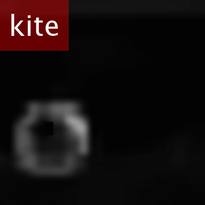
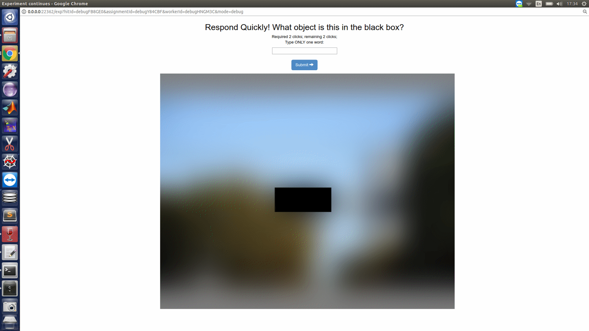

# Lift-the-flap: what, where and when for context reasoning

Authors: Mengmi Zhang, Claire Tseng, Karla Montejo, Joseph Kwon, Gabriel Kreiman

This repository contains an implementation of a recurrent attention deep learning model for contextual reasoning in natural scenes. Our paper is currently under review.

Access to our unofficial manuscript [HERE](https://arxiv.org/abs/1902.00163).

## Project Description

Context reasoning is critical in a wide variety of applications where current inputs need to be interpreted in the light of previous experience and knowledge. Both spatial and temporal contextual information play a critical role in the domain of visual recognition. Here we investigate spatial constraints (what image features provide contextual information and where they are located), and temporal constraints (when different contextual cues matter) for visual recognition. The task is to reason about the scene context and infer what a target object hidden behind a flap is in a natural image. To tackle this problem, we first describe an online human psychophysics experiment recording active sampling via mouse clicks in lift-the-flap games and identify clicking patterns and features which are diagnostic for high contextual reasoning accuracy. As a proof of the usefulness of these clicking patterns and visual features, we extend a state-of-the-art recurrent model capable of attending to salient context regions, dynamically integrating useful information, making inferences, and predicting class label for the target object over multiple clicks. The proposed model achieves human-level contextual reasoning accuracy, shares human-like sampling behavior and learns interpretable features for contextual reasoning.


| [](gif/ori.jpg)  | [](gif/humans_clicks.gif) |[](gif/model_clicks.gif)  | [](gif/model_attention.gif) |
|:---:|:---:|:---:|:---:|
| Stimulus | Human Clicks | Clicks predicted by model | Attention predicted by model | 

## Computational Model - ClickNet

### Pre-requisite

The code has been successfully tested in Ubuntu 18.04 with one GPU (NVIDIA RTX 2080 Ti). It requires the following:
- PyTorch = 1.1.0 
- python = 2.7
- CUDA = 10.2
- torchvision = 0.3.0

Dependencies:
- numpy
- opencv
- scipy
- matplotlib
- skimage

Refer to [link](https://www.anaconda.com/distribution/) for Anaconda installation. Alternatively, execute the following command:
```
curl -O https://repo.anaconda.com/archive/Anaconda3-2019.03-Linux-x86_64.sh
bash Anaconda3-2019.03-Linux-x86_64.sh
```
After Anaconda installation, create a conda environment:
```
conda create -n pytorch27 python=2.7
```
Activate the conda environment:
```
conda activate pytorch27
```
In the conda environment, refer to [link](https://pytorch.org/get-started/locally/) for Pytorch installation.

Download our repository:
```
git clone https://github.com/kreimanlab/lift-the-flap-clicknet.git
```

Download our pre-trained model from [HERE](https://drive.google.com/open?id=138Wn2Lmm2gBj5V_kmdN-GYxLMUUrq6os) and place the downloaded model ```checkpoint_2.pth.tar``` in folder ```/src/Models/```

### Quick Start

Evaluate our pre-trained model on one image ```Datasets/MSCOCO/testColor_img/trial_38.jpg``` using the following command:
```
python eval.py
```
It outputs a classification vector containing the probability of 55 object categories, the click locations, and the attention maps and saves it as ```/src/results/trial_1.mat```. Open MATLAB and visualize the results by running the following two scripts: ```eval/oursModel_ProcessMouseClick_NoAlpha.m``` and ```eval/Plot_qualatative_model.m```.

Train our model from the start using the following command:
```
python train.py
```
**NOTE** There is ONLY one training image in ```Datasets/MSCOCO/trainColor_img/``` and ```Datasets/MSCOCO/trainColor_binimg/``` for demonstration purpose. Continue to read the following sections if one wants to formally train the model using the FULL training set and evaluate the model using the FULL test set.

### Datasets

#### Training and testing sets

One should download the full training and test set (images and their corresponding binary masks (indicating the missing target location)) from [HERE](https://drive.google.com/open?id=1M_pcW0oyNpPPvyC929A0PaaspzNjFzYQ), unzip and place them in ```Datasets/MSCOCO/``` folder.  

#### Datalist to load images

One should download the list of image names and their corresponding class labels from [HERE](https://drive.google.com/open?id=1d3VWtMus6U1jzB4fTDr3-BIgs4byhJX4), unzip and place them in ```Datalist``` folder. 

### Training and Testing

Run the following script to train:
```
python train.py
```
Evaluate the model on full test set using the following command:
```
python eval.py
```
Download the full MATLAB evaluation codes from [HERE](https://drive.google.com/open?id=15i7l1k3Lulj8jGEM8cKZKG0pBphhu3IP) to replicate the results in our paper. The recommended MATLAB version is 2019a. Some plotting functions might be disabled for previous MATLAB versions.

## Human Mouse Clicking Experiments on Amazon Mechanical Turk 

Below is an animation for human mouse clicking experiments on Mturk. We designed the Mturk experiments using [Psiturk](https://psiturk.org/) which requires javascripts, HTML and python 2.7. The source codes have been successfully tested on MAC OSX and Ubuntu 18.04. See sections below for installation, running the experiments locally and launching the experiments online.

 

### Installation of Psiturk

Refer to [link](https://www.anaconda.com/distribution/) for Anaconda installation. Alternatively, execute the following command:
```
curl -O https://repo.anaconda.com/archive/Anaconda3-2019.03-Linux-x86_64.sh
bash Anaconda3-2019.03-Linux-x86_64.sh
```
After Anaconda installation, create a conda environment:
```
conda create -n mturkenv python=2.7
```
Activate the conda environment:
```
conda activate mturkenv
```
Install psiturk using pip:
```
pip install psiturk
```
Refer to [HERE](https://drive.google.com/open?id=1FblDG7OuWXVRfWo0Djb5eDiYgKqnk9wU) for detailed instruction on setting up psiturk account.

### Running the experiment locally

Download the source codes from [HERE](https://drive.google.com/open?id=147-NY35j3qzGu9Hilsm0kltrlqKJcTV8). Unzip, open a command window, navigate to the folder, and run the experiment in debug mode:
```
cd expF_click
psiturk
server on
debug
```

We now list a detailed description of important source files:

### Launching the experiment online using Elastic Cloud Computing (EC2) in Amazon Web Services (AWS)

Copy the downloaded source codes to EC2 server and run the psiturk experiment online. Refer to [HERE](https://drive.google.com/open?id=1FblDG7OuWXVRfWo0Djb5eDiYgKqnk9wU) for detailed instruction

## Notes

The source code is for illustration purpose only. Path reconfigurations may be needed to run some MATLAB scripts. We do not provide techinical supports but we would be happy to discuss about SCIENCE!

## License

See [Kreiman lab](http://klab.tch.harvard.edu/code/license_agreement.pdf) for license agreements before downloading and using our source codes and datasets.
