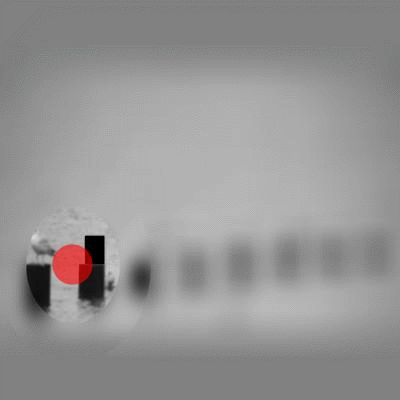

#Lift-the-flap: what, where and when for context reasoning

Authors: Mengmi Zhang, Claire Tseng, Karla Montejo, Joseph Kwon, Gabriel Kreiman

This repository contains an implementation of a recurrent attention deep learning model for contextual reasoning in natural scenes. Our paper is currently under review.

Access to our unofficial manuscript [HERE](https://arxiv.org/abs/1902.00163).

## Project Description

Context reasoning is critical in a wide variety of applications where current inputs need to be interpreted in the light of previous experience and knowledge. Both spatial and temporal contextual information play a critical role in the domain of visual recognition. Here we investigate spatial constraints (what image features provide contextual information and where they are located), and temporal constraints (when different contextual cues matter) for visual recognition. The task is to reason about the scene context and infer what a target object hidden behind a flap is in a natural image. To tackle this problem, we first describe an online human psychophysics experiment recording active sampling via mouse clicks in lift-the-flap games and identify clicking patterns and features which are diagnostic for high contextual reasoning accuracy. As a proof of the usefulness of these clicking patterns and visual features, we extend a state-of-the-art recurrent model capable of attending to salient context regions, dynamically integrating useful information, making inferences, and predicting class label for the target object over multiple clicks. The proposed model achieves human-level contextual reasoning accuracy, shares human-like sampling behavior and learns interpretable features for contextual reasoning.

|   |  |  |  |
|:---:|:---:|:---:|:---:|
| Stimulus | Human Clicks | Clicks predicted by model | Attention predicted by model | 

## Pre-requisite

The code has been successfully tested in Ubuntu 18.04. Only CPU is required. To speed up computation, GPU is highly recommended (11GB GPU memory). 

It requires the deep learning platform PyTorch and python2.7. 

Refer to [link](http://torch.ch/docs/getting-started.html) for Pytorch installation. 

Refer to [link](http://torch.ch/docs/getting-started.html) for Anaconda installation.  

Then excute the following commands in your command window:

